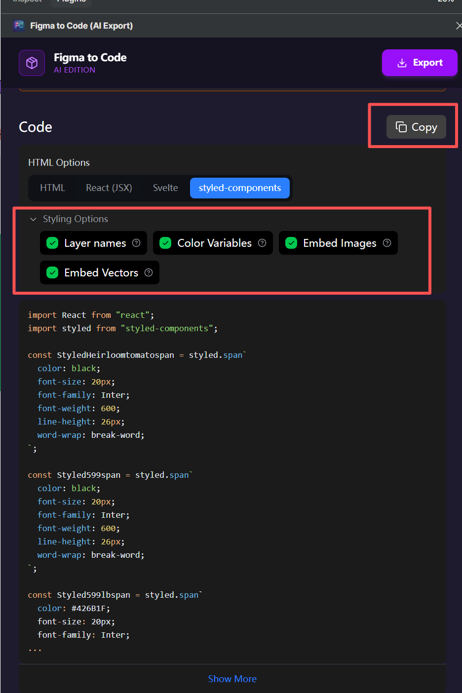

# React2FGUI 🚀

> **A powerful tool to convert Figma-exported React (Styled Components) directly into FairyGUI project packages.**

This tool automates the bridge between UI designers (Figma) and game developers (FairyGUI), bypassing manual renaming or PSD middle-man files.

## 🎯 Project Goal
Enable a "One-Click" workflow from Figma design to a fully functional FairyGUI `.fui` package.

## 🛠️ Prerequisites

This tool relies on the **Figma to Code (AI Export)** plugin to generate the source data.

1.  **Figma Plugin**: [Figma to Code (AI Export)](https://www.figma.com/community/plugin/1590340205277776745/figma-to-code-ai-export)
2.  **Export Configuration**: 
    To ensure compatible output, please use the following settings in the plugin:
    *   **Format**: `styled-components`
    *   **Styling Options**: 
        *   [x] Layer names
        *   [x] Color Variables
        *   [x] Embed Images
        *   [x] Embed Vectors



## 🏗️ Architecture

1. **Parser**: Analyzes `styled-components` React code to extract nodes, styles (CSS), and hierarchy.
2. **Mapper**: Automatically maps React component semantics to FGUI elements:
    *   `StyledButton` -> `GButton`
    *   `StyledSpan` / Text content -> `GTextField`
    *   `StyledDiv` / Containers -> `GGraph` (Rect) or `GComponent`
3. **Generator**: Produces FGUI-compatible `package.xml` and component `.xml` files.

## 🚀 Usage

```bash
# Install dependencies
bun install

# Link the CLI tool
bun link

# Run conversion
# Syntax: react2fgui <reactFile> <outPath> <packName> <mainComponentName>
react2fgui input.tsx ./output MyPackage MainUI
```

## 🎯 Features
- [x] **Absolute Positioning**: Accurate mapping of `left`, `top`, `width`, and `height`.
- [x] **Smart Semantics**: Automatic detection of Buttons and Input fields based on component names.
- [x] **Text Sync**: Full support for font size, color, and raw text extraction.
- [x] **CLI Tool**: Quick validation and batch processing.
- [ ] **SVG Support**: Auto-extracting `<svg>` paths into FGUI shapes (In Progress).
- [ ] **FGUI Plugin**: Ready-to-use plugin for the FGUI Editor (Planned).

## 📄 License
MIT
